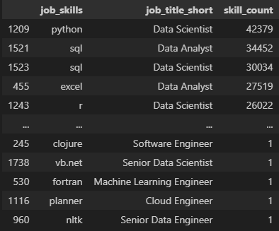

# Data Jobs Python Project

## Introduction
#### Background
This is part of a 4 step learning journey for data analysis.  During this part, I am learning about Python and it's applications for data analysis. I am specefically using a data set from the job data market from 2023 to see which set of skills are preffered among employers through their job applications they post. Using this program, it will allow me to gain a better understanding of the market and developing my python coding skills that is widely used by professionals around the world. My goal is to use the same set of data throughout my journey, analyzing and extracting the data with with SQL, Excel, Power BI, and Python.

#### Goals
1. Find the most in demand skills for the top 3 data analyst roles.
2. Discover the trends for in demand data analyst skills.
3. Realize the earning potential each data job has.
4. Analyzing the skills, salaries, and job titles in a final step for decision making.

#### Plan
- Devise a code that will first import all the required libraries and datasets.
- Uncover raw data using python techniques into statistics for data jobs.
- Visualize out the data using pandas, matplotlib, and seaborn to better understand what we are looking at.
- Dive deep into explaining the data we have discovered to make real-life decisions.

## Procedure
#### 1. Top in demand skills for data analyst roles:

After devising two main lines of code that defines the skill count and job titles, I will put them together with the matplotlib library that I imported. I will then make another data extraction point for the percent presence for each skill and again combining it with the job title listed to get a descriptive picture of well job skills associate with job titles. 

- [Code](https://github.com/RyanLHicks/data_analysis_jobs_python/blob/main/1_project/2_skills_count.ipynb):
```
    ## Extracts job skill count
df_skills_count = df_skills.groupby(['job_skills', 'job_title_short']).size()
df_skills_count = df_skills_count.reset_index(name='skill_count')
df_skills_count.sort_values(by='skill_count', ascending=False, inplace=True)
df_skills_count

    ## Extracts job titles
job_titles = df_skills_count['job_title_short'].unique().tolist()
job_titles = sorted(job_titles[:3]) 
job_titles
```
- Results:
    
    - Finding the job skill count
    
               
    
    - Uncovering the percent of skills associated with job postings
    
                         


- Interpretation:
    - After ucovering the data associated with a data analyst, data engineer, and data scientist roles; it's clear that SQL and python are the most sought after skills in job postings for these positions. This gives a clear direction of where to practice and master skills to give an aspiring data analyst the best shot at acquiring these jobs.

#### 2. Skill Trends for data analysts
I find the data analyst skills and their monthly trends throughout the year 2023. After dissecting the data based on the month and skill count for each skill, I visualized the data to help anyone understand which skills are more likely to appear on a job posting fora  data analyst. 

- [Code:](https://github.com/RyanLHicks/data_analysis_jobs_python/blob/main/1_project/3_skills_trend.ipynb)
```
    ## Finds the data to determine monthly trends of skills
df_da_us_pivot = df_da_us_explode.pivot_table(index='job_posted_month_no', columns='job_skills', aggfunc='size', fill_value=0)
df_da_us_pivot.loc['Total'] =  df_da_us_pivot.sum()
df_da_us_pivot = df_da_us_pivot[df_da_us_pivot.loc['Total'].sort_values(ascending=False).index]
df_da_us_pivot = df_da_us_pivot.drop('Total')
df_da_us_pivot

    ## Defines trends for percent basis
df_da_us_perc = df_da_us_pivot.div(da_totals/100, axis=0)
df_da_us_perc

    ## Defines trends for percent basis with month added
df_da_us_perc = df_da_us_perc.reset_index() 
df_da_us_perc['job_posted_month'] = df_da_us_perc['job_posted_month_no'].apply(lambda x: pd.to_datetime(x, format='%m').strftime('%b'))
df_da_us_perc = df_da_us_perc.set_index('job_posted_month')
df_da_us_perc = df_da_us_perc.drop(columns='job_posted_month_no')
df_da_us_perc

    ## Cleans up previous visualization and uses percent trend
df_plot = df_da_us_perc.iloc[:, :5]

sns.lineplot(data = df_plot, dashes=False, palette='tab10')
sns.set_theme(style='ticks')
sns.despine()

plt.title('Trending Skills for Data Analysts in the US')
plt.ylabel('Percent of Job Skills in Postings')
plt.xlabel('2023')
plt.legend().remove()

from matplotlib.ticker import PercentFormatter
ax = plt.gca()
ax.yaxis.set_major_formatter(PercentFormatter(decimals=0))

for i in range(5):
    plt.text(11.2, df_plot.iloc[-1, i], df_plot.columns[i])
```
- Results:
    - Finds the raw data associated with skills and trend during the year 2023

         

    - Converted the raw data into percent format based on the total listings for each skill    

                                                          


- Interpretation:
    - After graphing the raw data of skills and their associated trends throughout the year, I can confindently say that learning SQL, Excel, and Python are going to increase your chances of landing a data analyst position. SQL seems to be the most desired skill from employers for data analysts in the US. This helps anyone trying to get into this field to priotize certain learnable hard skills companies want out of their canadites.
    
#### 3. Salary details for data analyst jobs
- [Code:](https://github.com/RyanLHicks/data_analysis_jobs_python/blob/main/1_project/4_salary_analysis.ipynb)
```
    ## Defines the top 6 job titles from the data set
df_us_top6 = df_us[df_us['job_title_short'].isin(job_titles)]
job_order = df_us_top6.groupby('job_title_short')['salary_year_avg'].median().sort_values(ascending=False).index
top_job_titles = df_us.groupby('job_title_short')['salary_year_avg'].median().sort_values(ascending=False).head(6)
print(top_job_titles)

    ## Graphs the top 6 job titles in a boxplot
sns.boxplot(data=df_us_top6, x='salary_year_avg', y='job_title_short', order= job_order)
sns.set_theme(style='ticks')

plt.title('Salary Distributions in the United States')
plt.xlabel('Yearly Salary (USD)')
plt.ylabel('')
ticks_x = plt.FuncFormatter(lambda y, pos: f'${int(y/1000)}K')
plt.gca().xaxis.set_major_formatter(ticks_x)
plt.show()

    ## Sorts the top paying skills for the data analyst position
df_da_top_pay = df_da_us.groupby('job_skills')['salary_year_avg'].agg(['count', 'median']).sort_values(by='median', ascending=False)

df_da_top_pay = df_da_top_pay.head(10) 

df_da_top_pay

    ## Finds the most common data analyst skills along with the pay
df_da_skills = df_da_us.groupby('job_skills') ['salary_year_avg'].agg(['count', 'median']).sort_values(by='count', ascending=False)
df_da_skills = df_da_skills.head(10) 
df_da_skills


    ## Plots the top paying data analyst skills and the top occuring data analyst skills 
fig, ax = plt.subplots(2,1)

sns.set_theme(style='ticks')

sns.barplot(data=df_da_top_pay, x='median', y=df_da_top_pay.index, hue='median', ax=ax[0], palette='dark:b_r')
ax[0].legend().remove()
 
ax[0].set_title('Top 10 Paid Skills for Data Analysts')
ax[0].set_ylabel('')
ax[0].set_xlabel('')
ax[0].xaxis.set_major_formatter(plt.FuncFormatter(lambda x, _: f'${int(x/1000)}K'))

fig.tight_layout()

sns.set_theme(style='ticks')

sns.barplot(data=df_da_skills, x='median', y=df_da_skills.index, hue='median', ax=ax[1], palette='dark:b_r')
ax[1].legend().remove()
 
ax[1].set_title('Top 10 Common Skills for Data Analysts')
ax[1].set_ylabel('')
ax[1].set_xlabel('')
ax[1].xaxis.set_major_formatter(plt.FuncFormatter(lambda x, _: f'${int(x/1000)}K'))


fig.tight_layout()
```
- Results:

**Finds the top paying roles:**

                                    1

**Find the top paying skills within data analysts and the most common skills:**


                                   
- Interpretation:
    - We can see through this analysis that Senior Data Scientists and Senior Data Engineers on average get paid the most and this lines up with general expectations of career growth, while data analysts are typically on the lower pay scale.
    - After finding the top skills for data analysts specefically, skills that are more niche will pay more like dplyr and bitbucket. Finding the common skills for data analysts it's clear that python, sql, and tableau are more likely to pay more for just the data analyst role.

##### 4. Optimal skills for all data analyst roles
- [Code:](https://github.com/RyanLHicks/data_analysis_jobs_python/blob/main/1_project/5_optimal_skills.ipynb)
```
    ## Finds how likely data analyst skills are going to appear on a job description and finds salary associated with the skill
df_da_skills = df_da_us_exploded.groupby('job_skills')['salary_year_avg'].agg(['count', 'median']).sort_values(by='count', ascending=False)

df_da_skills = df_da_skills.rename(columns={'count': 'skill_count', 'median': 'median_salary'})

da_job_count = len(df_da_us)

df_da_skills['skill_percent'] = df_da_skills['skill_count'] /  da_job_count * 100

skill_percent = 5

df_da_skill_high_demand = df_da_skills[df_da_skills['skill_percent'] > skill_percent]

df_da_skills

    ## Plots the skill occurance and median salary for data analyst roles.
from adjustText import adjust_text

df_da_skill_high_demand.plot(kind='scatter', x='skill_percent', y='median_salary')

texts= []
for i, txt in enumerate(df_da_skill_high_demand.index):
    texts.append(plt.text(df_da_skill_high_demand['skill_percent'].iloc[i], df_da_skill_high_demand['median_salary'].iloc[i], txt))

adjust_text(texts, arrowprops=dict(arrowstyle='->', color='gray'))


plt.xlabel('Percent of Data Analyst Jobs')
plt.ylabel('Median Yearly Salary')
plt.title('Most Optimal Skills for Data Analysts')

from matplotlib.ticker import PercentFormatter
ax = plt.gca()
ax.yaxis.set_major_formatter(plt.FuncFormatter(lambda y, pos: f'${int(y/1000)}K'))
ax.xaxis.set_major_formatter(PercentFormatter(decimals=0))

plt.tight_layout   
plt.show()
```
- Results:

**Finds the top paying data analyst skills occurance**

                               


- Interpretation:

## Conclusion
####Interpretation
#### Future
#### Sources
